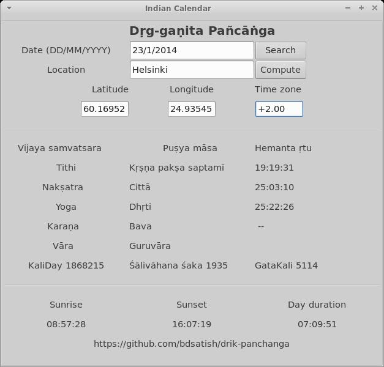
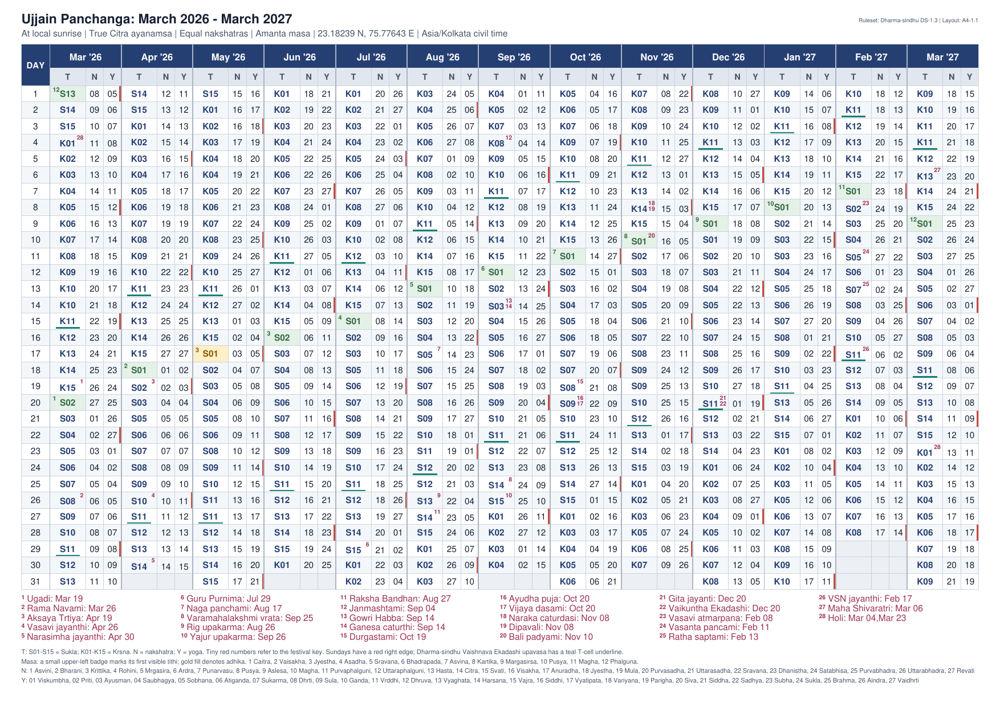

Drik Panchanga
==============

Observational Indian lunisolar calendar using the Swiss ephemeris (Hindu
Drig-ganita Panchanga).

Features
--------

Computation of the five essentials of the panchangam:
* Tithi
* Nakshatra
* Yoga
* Karana
* Vaara

Not just the values, but also the end times of tithis and nakshatras
are computed. The only factor limiting the accuracy of the program
output is the uncertainity in your input values (latitude, longitude).

Also includes computation of sunrise, sunset, moonrise and moonset.

Included in the CLI version (not yet in GUI):
* Instantaneous planetary positions, including Lagna (Ascendant)
* Navamsa positions
* Choghadiya/Gauri panchanga
* Vimsottari Dasha-Bhukti
* Rahu Kala, Yamaganda Kala, Gulika Kala
* Abhijit muhurta and Durmuhurtams


By default, the month type is Amavasyanta (new moon to new moon) which
is most prominent type of calendar used in South India.

NOTE:
All timings are end timings. Timings displayed higher than 24:00 denote
hours past midnight because the Hindu day (tithi) starts and ends with
sunrise. If applicable, daylight savings (DST) are accounted for
automatically based on the date and place entered in the textboxes.


Requirements
------------

This app works with both Python 2 and Python 3. The only difference is that Python 2
needs wxgtk-3.0 whereas Python 3 needs wxgtk-4.0. The codebase is compatible with both
Python 2 and 3. See below for Python 3.

### Python 2 (DEPRECATED) ###

Python interface to Swiss ephemeris.

```
pip install --user pyswisseph  # OR apt-get install pyswisseph
```

The core of the library (`panchanga.py`) can be imported into other code
or used from the command line.

In order to just _run_ the GUI (`gui.py`) you also need python-tz and
wxPython (interface to wxWidgets):

```
apt-get install python-tz
apt-get install python-wxgtk3.0
```

If you want to _modify_ the GUI (`Gui.wxg`), you must use wxGlade:

```
apt-get install python-wxglade
```

Wxglade 0.7.0 is buggy (0.6.8 is ok), try the development version from [here][wxgde].

[wxgde]: https://github.com/wxGlade/wxGlade/releases

How does it look?

[Sample screenshot](screenshot.jpg):



### Python 3 ###

Tested with Python 3.12, wxgtk 4.2.2, wxglade 0.8.1.

```
apt-get install python3-tz python3-wxgtk4.0 python3-wheel
pip3 install --user pyswisseph  # or apt-get
python3 gui.py
```

If you want to _edit_ the GUI, download [wxGlade](https://github.com/wxGlade/wxGlade/releases)
and directly run:

```
python3 wxglade.py
```

and open `Gui.wxg`.

### One-page calendar PDF ###

`generate_panchanga_calendar.py` creates a single-page A4 landscape calendar
covering 13 consecutive Gregorian months. Each day shows:

* `T`: tithi number at local sunrise (`01`-`15`); blue ink is Sukla, dark ink is Krsna
* `N`: nakshatra number (`01`-`27`)
* `Y`: yoga number (`01`-`27`)
* the amanta lunar month at its first sunrise-visible tithi

Calculations use Swiss Ephemeris with the True Citra ayanamsa. Adhika months
have a gold cell and Sundays have a red right edge. The teal underline marks
Ekadashi upavasa (`S11` / `K11` in the ruleset) under the same sunrise rule as festivals.
A brown X in the lower-left corner marks days with a locally visible eclipse.
Numbered red superscripts refer to the festival key below the calendar. The
footer also lists locally visible partial, total, and annular eclipses for the
printed Gregorian range, each with its local visibility window and that date's
sunrise (`None` when none qualify). Ruleset and layout versions
are printed at the top right and embedded in the PDF metadata so a generated
calendar can be reproduced or compared after rule changes.

#### Setup

The PDF generator requires Python 3.9 or newer. Create a local virtual
environment and install `pyswisseph`, ReportLab, and their dependencies:

```
./setup_venv.sh
source .venv/bin/activate
```

Swiss Ephemeris needs the `.se1` data files. By default `setup_venv.sh`
and `panchanga.py` use a per-user data directory:

- Linux / macOS: `~/.local/share/swisseph` (or `$XDG_DATA_HOME/swisseph`)
- Windows: `%LOCALAPPDATA%\swisseph`

If that directory has no `.se1` files, setup asks before sparse-cloning
~100 MB from
[aloistr/swisseph](https://github.com/aloistr/swisseph/tree/master/ephe).
Declining is fine — setup still finishes — but planetary calculations will
fail or use the coarser Moshier fallback until the files are present. The
venv exports `SE_EPHE_PATH` on activate. To use an existing copy:

```
SE_EPHE_PATH=/path/to/ephemeris/files ./setup_venv.sh
source .venv/bin/activate
```

Select a city and the first month of the 13-month range:

```
python generate_panchanga_calendar.py \
  --city Paris \
  --start 2026-06
```

Cities are read from `cities.json` next to the generator. Its IANA time-zone
names, such as `Europe/Paris`, allow daylight-saving changes to be applied
separately to every date. City matching is case-insensitive. Use
`--output FILE.pdf` to choose the output path:

```
python generate_panchanga_calendar.py \
  --city Ujjain \
  --start 2026-03 \
  --output ujjain_panchanga_mar2026_mar2027.pdf
```

Which festivals appear in the PDF is controlled by `festivals.cfg` next to the
generator (every catalog name must be listed as `yes` or `no`). Override the
path with `--festivals FILE.cfg` if needed.

Run the regression tests with:

```
python -m unittest discover -p 'test_*.py'
```

To leave the virtual environment when finished, run:

```
deactivate
```

#### Festival dates and conventions

Festival and Ekadashi dates are resolved for the selected location in
`festival_rules.py` (ruleset `Udaya-Vyapini-1.0`). The older multi-policy
implementation is kept under `experimental/` for reference only. The PDF
includes only festivals enabled in `festivals.cfg` (see Setup above).

**Common sunrise rule.** A festival tied to a tithi uses the civil day where
that tithi prevails at local sunrise. If the same tithi covers two consecutive
sunrises (vriddhi), the earlier day is kept. If the tithi is skipped between
sunrises (kshaya), the later civil day is kept. Adhika (intercalary) masas are
skipped for ordinary festivals. Ugadi is the exception: when both adhika and
nija Chaitra `S1` occur, only the adhika date is marked.

Most numbered festivals are plain amanta masa + tithi pairs under that rule
(for example Rama Navami = Chaitra `S9`, Deepavali = Ashvina `K15`). Ekadashi
underlines use the same rule for every `S11` and `K11`; they are not the
*Dharma-sindhu* four-ghati Arunodaya / Mahadvadashi machinery.

**Non-tithi festivals** have dedicated selectors:

* Varamahalakshmi Vrata — Friday strictly before nija Sravana Purnima (`S15`).
* Yajur Upakarma — nija Sravana `S15`. If eclipsed (see below), postpone to
  Bhadrapada `S15`.
* Rig Upakarma — nija day whose sunrise nakshatra is Sravana (`22`); if that
  nakshatra is missing at sunrise in Sravana masa, or the chosen day is
  eclipsed (see below), use Bhadrapada's Sravana-nakshatra day. Vriddhi keeps
  the former sunrise.

  Upakarma eclipse test (Yajur and Rig): postpone only when a locally visible
  non-penumbral lunar eclipse overlaps the chosen day's sunrise-to-next-sunrise
  window. Solar and purely penumbral lunar eclipses are ignored. This is a
  deliberate Udaya-Vyapini simplification; Dharma-sindhu / Nirnaya-sindhu often
  use a midnight-to-midnight Upakarma window instead.
* Vaikuntha Ekadashi — a Margashirsha or Pausha Shukla Ekadashi upavasa day
  while the Sun is in Dhanur at sunrise. If none qualify, the PDF prints
  `None`.
* Makara Sankranti — first civil sunrise after the Sun enters Makara.

Dates are sunrise- and location-dependent, so the same festival can fall on
different Gregorian days in different cities. A city inside a polar-night or
midnight-sun period cannot be generated for dates on which Swiss Ephemeris
cannot provide a local sunrise.

#### Example: Ujjain, March 2026 through March 2027

The following image is the first and only page generated by the Ujjain command
above:



Using the GUI
-------------

### Location known ###

First, type the Date in DD/MM/YYYY format in the 'Date' field. Negative value for YYYY are
interpolated as proleptic Gregorian calendar.

Second, type your location (city or district) in the Location field and click 'Search'.  If found,
then the coordinates and time zone are updated. If not, try the [next method](#location-unknown).
If your location's population is more than 50,000 then the location should be found.

Third, click 'Compute'. Now the fields like tithi, etc. are computed and shown on the GUI.

### Location unknown ###

First, type the Date in DD/MM/YYYY format in the 'Date' field.

Second, manually enter the coordinates and time zone of your location. You can use
[Google Maps](http://maps.google.com) or [Time and Date website](http://www.timeanddate.com/) for
this purpose.

Third, click 'Compute'.  Now the fields like tithi, etc. are computed and shown on the GUI.


Accuracy
--------

The program is as accurate as the Swiss Ephemeris installed on your system. So generally it is
accurate for years 5000 BCE to 5000 CE, especially in the range 2500 BCE - 2500 CE. The
computational speed stays the same no matter which date you enter. Compared to other software listed
in the [References](#references), our software is way better in this sense.

As a simple test, try to compute the date of Madhva Navami, which is celebrated as the disappearance
day of the Indian philosopher [Madhvācārya](http://en.wikipedia.org/wiki/Madhvacharya). The exact
date is 1317 CE, Māgha-māsa śukla-pakṣa navamī. All other software listed in
[References](#references) give error "Year out-of-range".  But in our software, enter the place
"Udipi" and date "30/1/1317" and you indeed get Māgha śuddha navamī. You can cross-verify it on the
[Calendrica website](http://emr.cs.iit.edu/home/reingold/calendar-book/Calendrica.html).

Note that dates before 1582 must be entered in
[proleptic Gregorian](https://en.wikipedia.org/wiki/Proleptic_Gregorian_calendar), which is a
natural back-interpolation of the current Gregorian calendar we use everyday.


About the calendar
------------------

There are two schools of Indian calendar makers:

1. Those who follow the rules of the [_Sūrya Siddhāntā_](http://en.wikipedia.org/wiki/Surya_Siddhanta)
   (SS, Theory of the Sun) or its variants like _Ārya Siddhānta_ of Aryabhata.
2. Those who follow the _Dṛk Siddhāntā_ (Empirical Theory).

SS contains semi-analytical equations for specifying the positions of sun and moon.
However, the constants in these equations have to be updated regularly ( _bīja saṃskāra_ ).
But the equations in SS were last updated around 1000 CE, so they no longer match the
planetary positions as we see today. For example, the date of solar eclipse as predicted
by the equations of SS are off by many hours from its actual occurence. In spite of this,
most Hindu maṭhas still publish yearly pañcāṅgas according to the rules of SS, in the name
of preserving and practising tradition ( _paramparā_ ).

The latter one, _Drik_ school, still follow the general concepts from SS,
but get the planetary positions from measured or observed data (dṛś = to see).
Hence, their results match accurately with observed celestial phenomena.
The [Swiss Ephemeris](http://www.astro.com/swisseph/swephinfo_e.htm) is probably
the best source available today for planetary calculations. It provides highly
accurate databases of planetary data for about 10000 years. Hence, this panchanga
is based on the Swiss Ephemeris. Other databases include those published by NASA's
JPL (DE405) or the Moshier ephemeris.

#### Śubhāśubha Samaya

Gaurī (Gowri) Panchanga and Choghadiya are south Indian and north Indian names
respectively, for the same mathematical calculation. Basically, day and night
duration are each divided into eight parts; the difference between N.Indian and
S.Indian lies in their names and which part is considered
auspicious/inauspicious. In the S.Indian variant, Tamilians use
[different order][kowri] and names compared to Kannadigas/Telugus. This program
provides the latter only. (This inconsitency alone is enough to let you know
that such concepts of (in-)auspiciousness are all pseudo-science).

Rāhukāla, Yamagaṇḍakāla, Gulikakāla, Durmuhūrtams and Varjyam are all considered
inauspicious. Abhijit muhūrta and Amṛtakāla are considered auspicious.

[kowri]: http://tamilastrology.hosuronline.com/KowriPanchangam/

### Uranus and Neptune ###

These planets were not discovered by Indian astronomers. They are sometimes
translated as "[Aruṇa graha][ar_hi]" and "[Varuṇa graha][va_hi]" in languages
like Hindi, Nepali, etc. Problem is that there is another trans-Neptunian
planet which is also called [Varuna][v20k] in English.

The Positional Astronomy Center [translates][pac] them as `हर्शल` and
`नेपच्यून`. This is inconsistent in the sense that Uranus was translated after its
discoverer (William Herschel) where as Neptune was phonetically transcribed from
English, instead of basing on its discoverer (Johann Galle). Therefore, I've
"Indianized" their names in a rhyming fashion as **`हर्षल`** (=Uranus) and
**`गाल्ल`** (=Neptune). They also mean "happy" and "cheek/chin" respectively in
many Indian languages.

Other probable names are: हिमनील (=icy-blue, Uranus), इन्द्रनील
(=sapphire-colored, Neptune), तुषार (=frigid), पलाश (=green),

[ar_hi]: https://hi.wikipedia.org/wiki/अरुण_(ग्रह)
[va_hi]: https://hi.wikipedia.org/wiki/वरुण_(ग्रह)
[pac]: http://www.packolkata.gov.in/download/hindi/Page_020.jpg
[v20k]: https://en.wikipedia.org/wiki/20000_Varuna

References
----------

These ones are helpful for implementing panchanga software:
* Karanam Ramakumar, [_Panchangam Calculations_](http://archive.org/details/PanchangamCalculations)
* [_Second Level of the Astronomical Calculations in GCAL_](http://www.krishnadays.com/eng/index.php?option=com_docman&task=doc_download&gid=7&Itemid=58),
 used in ISKCON's GCal software.

This is _the_ calendar book (though it mostly deals with Surya Siddhanta):
* Dershowitz and Reingold, _Calendrical Calculations_, 3rd edition, 2008.
  [Online Java applet](http://emr.cs.iit.edu/home/reingold/calendar-book/Calendrica.html).

* Shayamasundara Dasa, [_Vimsottari Year -- 360 or 365 ?_](http://shyamasundaradasa.com/jyotish/resources/articles/pdf_versions/english/360_vs_365.pdf)

#### Similar software ####

Prof. M. Yanom's [online interface](http://www.cc.kyoto-su.ac.jp/~yanom/pancanga/)
to his [Perl code](http://www.cc.kyoto-su.ac.jp/~yanom/sanskrit/pancanga/pancanga3.13) -- this
is the best version of the old Surya Siddhanta pancanga I've seen. However, the Surya Siddhanta
system (no fault with the Perl code) is not accurate if you want to work with dates which are
several centuries before our current time.

[drikpanchang](http://drikpanchang.com) is a reliable online calendar for the Drik.  However, it is
neither open source nor do they have a desktop program. This website doesn't work for dates before
1600 CE. Their [Android app](https://play.google.com/store/apps/details?id=com.drikp.core) doesn't
work for dates outside the range 1900 - 2100 CE.


[Hindu Calendar](https://play.google.com/store/apps/details?id=com.alokmandavgane.hinducalendar)
for Android is another offline Drik calendar by Alok Mandavgane. Again, this is
not open source. This software has a bug that it doesn't account for daylight savings
in Europe. Also it doesn't work for dates outside the range 1900 - 2100 CE.

Among open source programs, I found these two:

* [On Google Code](http://panchangam.googlecode.com/svn/calc-v2): generates a pdf of
panchanga for any year and place, but imprecise. For ex., tithi end timings are off
by ten minutes sometimes. There is no GUI either.

* [On GitHub](https://github.com/santhoshn/panchanga): Based on Paul Schlyter's
semi-analytical model for [planetary positions](http://stjarnhimlen.se/comp/ppcomp.html).
This program gives the panchanga for a given _instant_ but doesn't ask for a place's
coordinates or timezone. This is probably because the program doesn't compute sunrise
timings at all! The planetary model fails for dates outside the range 1800 CE to 2100 CE.


Licence
-------

Copyright © Satish BD. Licensed under the GNU Affero GPL version 3 (or later).


Word of caution
---------------

The so-called "Vedic astrology" has no basis in the Vedas, Upanishads, Bhagavad
Gita, Mahabharata or Ramayana. It is a [fringe science][1] of Hinduism. The
original [Vedanga Jyotisha](https://archive.org/details/VedangaJyotisa) (~1200
BCE) and [Surya Siddhanta](https://archive.org/details/in.ernet.dli.2015.69065)
(~400 CE) are purely astronomical.

[1]: https://en.wikipedia.org/wiki/Fringe_science

#### TODO ####

* Amritakala
* gettext translations
* Harmonize all functions to use UT aka UT1 instead of UTC or ET
  (`swe.jdut1_to_utc() <==> swe.utc_to_jd()[1]`, `swe.utc_time_zone()`,  etc.)
