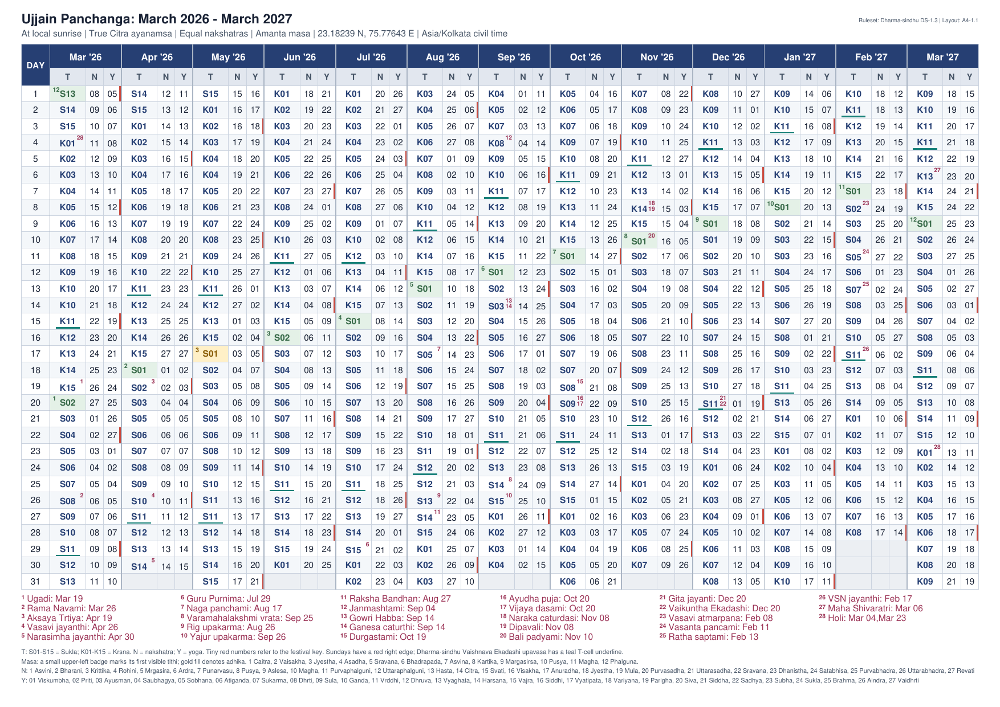
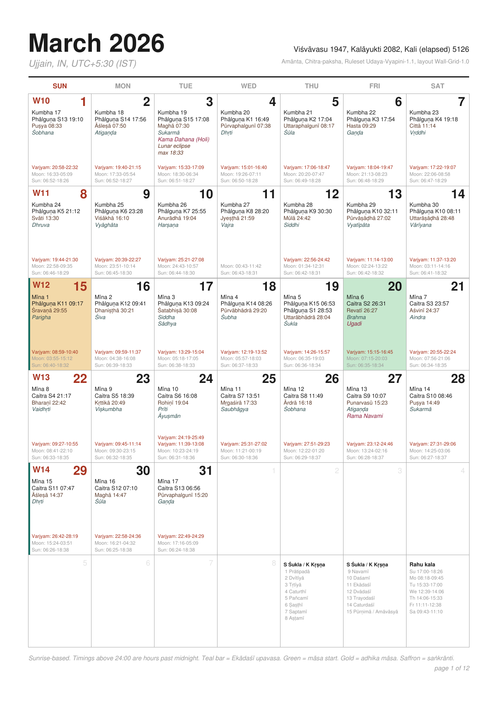

Calendar PDFs — details
=======================

Two PDF layouts share the same computation, colours, and markers:

* **One-page** (`generate_panchanga_calendar.py` / `drik-panchanga-short`):
  14 consecutive months on a single A4 landscape sheet.
* **Monthly wall calendar** (`generate_monthly_calendar.py` /
  `drik-panchanga-long`): one A4 portrait grid page per month, 12 pages,
  with wider rows suited for reading a full month at a glance.

The monthly calendar shares the computation and festival/eclipse markers with
the one-page calendar, with its own palette.

Common options
--------------

```
--city "Ujjain, IN"      # data/cities.json; country code disambiguates
--start 2026-06          # first month of the span (14 or 12 months)
--month amanta|purnimanta
--ayanamsa citra|revati|rohini|pushya|mula|krishnamurti|raman|tropical
--festivals FILE.cfg
--output FILE.pdf
```

`--ayanamsa tropical` uses the equinox-referenced ecliptic instead of a
fixed-star (nirayana) reference. The PDF subtitle shows *Tropical (Sāyana)*
instead of an ayanamśa label, and the default filename gets a `_tropical`
suffix.

Daylight saving
---------------

A row is a Hindu day (sunrise to the next sunrise), but it is labelled with
the civil date it starts on, and every time in it is hours past that civil
midnight — so a time after midnight prints as `24:00` or later.

One civil date carries one UTC offset (its offset at local noon). When the
offset changes while a Hindu day is still running, the row keeps that label
and that offset up to the change, and its tail is printed with the offset
actually in effect after it: `28:17` becomes `29:17` on a spring-forward row,
and `31:05` becomes `30:05` on a fall-back row. The *DST starts* / *DST ends*
label stays on the civil date where the offset changes.

One-page legend
---------------

The one-page calendar lists both _sauramāna_ (solar) and _cāndramāna_ (lunar)
elements: tithi, nakshatra, yoga, vaara, solar date, festivals and eclipses.
Each day shows:

* `T`: tithi number at local sunrise (01-15); blue ink is Sukla,
  dark ink in italics is Krsna
* `N`: nakshatra number (01-27)
* `Y`: yoga number (01-27)
* lunar-month start: green T-cell with an upper-left māsa badge (amānta or
  pūrṇimānta, per `--month`); an adhika māsa badge carries an `A` prefix in
  addition to the gold cell fill
* solar-month start (saṅkrānti): peach N-cell with rāśi number 1–12 top-right;
  following N-cells mark solar days 7, 14, 21, and 28, with the count resetting
  at each saṅkrānti

Adhika months have a gold cell and Sundays have a red right edge. T-cell
underlines mark recurring observances: teal Ekadashi upavasa, purple Pradosham
(Mon/Sat), indigo Sankashtahara (Tue) (weekday specials only; `--recurring all`
underlines every occurrence). A brown wavy underline below Tithi marks days
with a locally visible eclipse. Numbered red superscripts refer to the
festival key below the calendar. The footer also lists locally visible
partial, total, and annular eclipses for the printed month range, each with
its local maximum time and that date's sunrise (`None` when none qualify).
Ruleset and layout versions are printed at the top right and embedded in the
PDF metadata so a generated calendar can be reproduced or compared after rule
changes.

Development setup
-----------------

```
./scripts/setup_venv.sh
source .venv/bin/activate
```

The script creates a venv, installs `pyswisseph` + ReportLab + Flask, and
optionally downloads the Swiss Ephemeris `.se1` data files (~100 MB from
[aloistr/swisseph](https://github.com/aloistr/swisseph/tree/master/ephe))
into the default location. To use your own copy:

```
SE_EPHE_PATH=/path/to/ephemeris/files ./scripts/setup_venv.sh
```

Festivals
---------

Festival selection and date-selection rules are documented in
[README.FESTIVALS.md](README.FESTIVALS.md). Use `--festivals FILE.cfg` to
provide a custom configuration. Fortnightly/monthly observances (Ekadashi,
Pradosham, Sankashtahara Chaturthi) are always on and need no cfg keys.

Festival dates themselves do not flip with `--month`: the catalog uses fixed
amānta month numbers so a named observance stays on the same civil day in
both display modes.

Example: Ujjain, March 2026 through March 2027
----------------------------------------------

One-page layout:



Monthly layout (March 2026 page):


