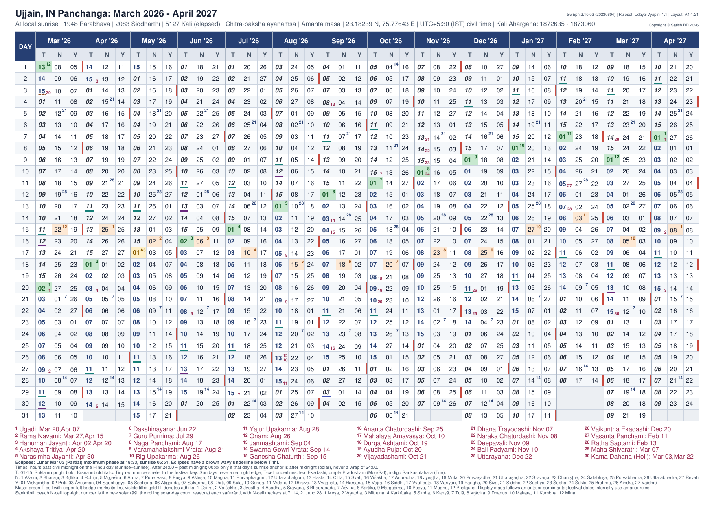
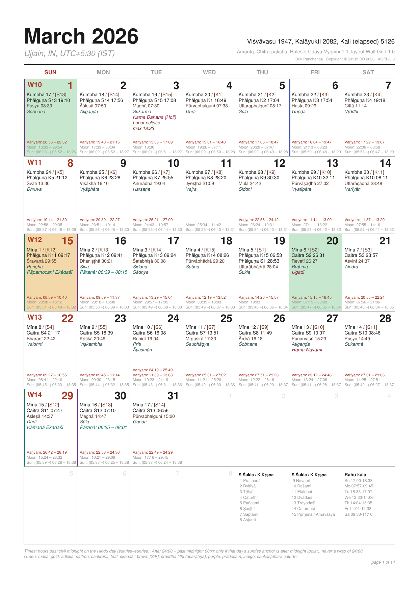

Calendar PDFs — details
=======================

Two PDF layouts share the same computation, colours, and markers:

* **One-page** (`generate_panchanga_calendar.py` / `drik-panchanga-short`):
  one lunar year on a single A4 landscape sheet.
* **Monthly wall calendar** (`generate_monthly_calendar.py` /
  `drik-panchanga-long`): one A4 portrait grid page per month of the lunar
  year, with wider rows suited for reading a full month at a glance.

Both layouts print the same span, and its length is never fixed. The
amānta cāndramāna year that `--start YYYY` names runs from the month
containing that year's **Ugadi** (Chaitra S1; adhika Chaitra when present)
through the month containing the **last day of Phālguna** — 12, 13 or 14
whole Gregorian months.

The monthly calendar shares the computation and festival/eclipse markers with
the one-page calendar, with its own palette.

Common options
--------------

```
--city "Ujjain, IN"      # data/cities.json; country code disambiguates
--place -13.4,70,5.5     # instead of --city: LAT,LON,TZ (see below)
--start 2026             # Gregorian year holding the lunar year's Ugadi
--start=-0500            # BCE: prefix the astronomical year with '-'
--month amanta|purnimanta
--ayanamsa citra|revati|rohini|pushya|mula|krishnamurti|raman|tropical
--festivals FILE.cfg
-o, --output FILE.pdf      # short: -o FILE.pdf
```

`--start` takes an astronomical year (year `0000` is 1 BCE) and the lunar year
in it; the month is never asked for. PDF and iCal years run `-3300 ... 3300`
for every ayanāṃśa — in sidereal modes Ugadi drifts about a day later every
70–80 years, so a few years before about -2950 hold two Ugadis (or none) and
are refused with a message naming the dates. Because whole months print, the
first month also shows the previous year's Phālguna and the last month the next
year's Chaitra, with their festivals; consecutive years share one month.
`--month purnimanta` changes only the māsa labels and badges, not the span.

`--place` takes three comma-separated decimal numbers instead of a city name:
latitude (negative = south), longitude (east = positive), and the timezone as a
UTC offset in hours (5.5 = UTC+5:30; no DST is applied). The header names the
place by its coordinates, e.g. `13.40S, 70.00E (UTC+5:30)`. Either `--city` or
`--place` must be given; when both are, `--place` wins.

`--ayanamsa tropical` uses the equinox-referenced ecliptic instead of a
fixed-star (nirayana) reference. The PDF subtitle shows *Tropical (Sāyana)*
instead of an ayanamśa label, and the default filename gets a `_tropical`
suffix.

Daylight saving
---------------

A row is a Hindu day (sunrise to the next sunrise), but it is labelled with
the civil date it starts on, and every time in it is hours past that civil
midnight — so a time after midnight prints as `24:00` or later.

One civil date carries one UTC offset (its offset at local noon). When the
offset changes while a Hindu day is still running, the row keeps that label
and that offset up to the change, and its tail is printed with the offset
actually in effect after it: `28:17` becomes `29:17` on a spring-forward row,
and `31:05` becomes `30:05` on a fall-back row. The *DST starts* / *DST ends*
label stays on the civil date where the offset changes.

Before the zone adopted standard time (India before 1854, every BCE date),
times use the city's own local mean time, longitude / 15 hours, and the
header shows it as e.g. `UTC+5:03 (LMT)` for Ujjain.

Polar regions
-------------

Above the polar circles the Sun can go days or months without rising or
setting. `sunrise()`/`sunset()` still return an anchor on every such day by
falling back to the matching meridian transit, which exists at every latitude
on every day:

- **Polar night** — sunrise and sunset both anchor at the upper transit (the
  noon glow): day length 0, night 24 h, as observed.
- **Midnight sun** — sunrise anchors at the lower transit (solar midnight) and
  sunset at the next day's lower transit: day length 24 h, night 0 h.

Both transits sit within ~30 minutes of the real sunrises on the days just
outside the polar period, so tithi, nakshatra, yoga, karaṇa and the derived
kalas (Rahu Kala, Abhijit, Durmuhurta, Varjyam, sandhya) stay continuous
across the polar edges. Solar-dependent intervals degrade truthfully: in
polar night, Rahu Kala etc. collapse to the transit instant (there is no
daylight to divide); in midnight sun they stretch to 1/8 of 24 h. Calendar
PDFs and the web UI therefore generate for any city on any date; no visual
marker distinguishes transit-anchored days from real sunrise days.

`00:xx` can still appear when the day's sunrise anchor itself sits just after
civil midnight (midnight sun); that is the anchor time, not a wrap bug.

One-page legend
---------------

The one-page calendar lists both _sauramāna_ (solar) and _cāndramāna_ (lunar)
elements: tithi, nakshatra, yoga, vaara, solar date, festivals and eclipses.
Each day shows:

* `T`: tithi number at local sunrise (01-15); blue ink is Sukla,
  dark ink in italics is Krsna
* `N`: nakshatra number (01-27)
* `Y`: yoga number (01-27)
* lunar-month start: green T-cell with an upper-left māsa badge (amānta or
  pūrṇimānta, per `--month`); an adhika māsa badge carries an `A` prefix in
  addition to the gold cell fill
* solar-month start (saṅkrānti): peach N-cell with rāśi number 1–12 top-right;
  following N-cells mark solar days 7, 14, 21, and 28, with the count resetting
  at each saṅkrānti

Adhika months have a gold cell and Sundays have a red right edge. T-cell
underlines mark recurring observances: teal Ekadashi upavasa, purple Pradosham
(Mon/Sat), indigo Sankashtahara (Tue) (weekday specials only; `--recurring all`
underlines every occurrence). A brown wavy underline below Tithi marks days
with a locally visible eclipse. Numbered red superscripts refer to the
festival key below the calendar. The footer also lists locally visible
partial, total, and annular eclipses for the printed month range, each with
its local maximum time and that date's sunrise (`None` when none qualify).
Ruleset and layout versions are printed at the top right and embedded in the
PDF metadata so a generated calendar can be reproduced or compared after rule
changes.

Festivals
---------

Festival selection and date-selection rules are documented in
[README.FESTIVALS.md](README.FESTIVALS.md). Use `--festivals FILE.cfg` to
provide a custom configuration. Fortnightly/monthly observances (Ekadashi,
Pradosham, Sankashtahara Chaturthi) are always on and need no cfg keys.

Festival dates themselves do not flip with `--month`: the catalog uses fixed
amānta month numbers so a named observance stays on the same civil day in
both display modes.

Example: Ujjain, lunar year 2026 (March 2026 – April 2027)
---------------------------------------------------------

`--start 2026` resolves to Ugadi 20 Mar 2026 through 6 Apr 2027, so the
fourteen printed months are March 2026 to April 2027:



Monthly layout (first page of the same year, March 2026):


